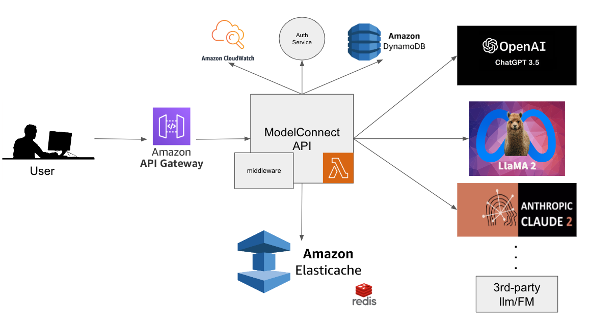

# ModelConnect

## Overview
This project is designed to build a robust, scalable, and secure API that acts as an intermediary between users and various Large Language Models (LLMs) and Foundation Models (FMs). The API is hosted on AWS, utilizing several AWS services for optimal performance, scalability, and monitoring.

## Design




### AWS API Gateway
Users interact with the system through the AWS API Gateway, which provides a reliable and secure entry point to the API.

### AWS Lambda
The core API logic resides in AWS Lambda, chosen for its auto-scaling capabilities which ensure that the system can handle varying loads efficiently without manual intervention.

### Middleware
A middleware component pre-processes user requests to filter out sensitive information, ensuring a layer of security and data privacy before requests are forwarded to the external APIs.

### AWS ElastiCache (Redis)
To optimize performance and reduce the load on external APIs, common queries and their results are cached using AWS ElastiCache with Redis, providing fast in-memory data retrieval. Optimization strategies include:

- **Exact Match Caching**: 
  - Cached results are returned for exact query matches.
  
- **Normalization**:
  - Queries are standardized to match despite punctuation, capitalization, or whitespace variations.
  
- **Keyword-based Caching**:
  - Cached results are stored and retrieved based on the keywords in a query.

- **Fuzzy Matching**:
  - An algorithm identifies and returns cached results for queries that are similar but not identical.

- **Semantic Hashing/Embedding**:
  - Queries are converted to a semantic hash or embedding for cache storage and retrieval, allowing semantically similar queries to return the same result.

- **Predefined Synonyms**:
  - Common synonyms are used to standardize queries before checking the cache.

- **Result Generalization**:
  - Cached results are generalized to cover a broader range of similar queries.


### Authentication Service
A generic authentication service is used to manage user identities and ensure that only authorized users can access the system.

### AWS DynamoDB
User requests, queries, results, and metadata are stored in AWS DynamoDB, a NoSQL database service that provides fast and predictable performance with seamless scalability.

### Monitoring
AWS CloudWatch is employed to monitor the API's performance, error rates, and usage metrics, enabling proactive issue detection and system optimization.

### LLM/FM Interface Adapters
The API interfaces with various LLMs and FMs through adapter layers, ensuring modularity and ease of integration with different external APIs.

## Directory Structure

- `ModelConnect/`: The root directory of your project, where all the files and sub-directories reside.
- `.env`: A file to securely store and manage environment variables such as API keys.
- `.gitignore`: Specifies the files and directories that should be ignored by Git, preventing sensitive or unnecessary files from being versioned.
- `requirements.txt`: Lists all the Python dependencies required to run the project.
- `app/`: Holds the main application code including the FastAPI app instance, route handlers, models, middleware, and utility functions.
- `app/adapters/`: Contains the adapter classes for interfacing with different LLMs and FMs.
- `app/middleware/`: Houses middleware components for pre-processing requests and post-processing responses.
- `app/routers/`: Organizes route handlers, which define the HTTP endpoints and the logic to handle requests.
- `app/utils/`: Stores utility functions and classes that are used across the application, such as caching functionality.
- `tests/`: Contains test files for checking the correctness and robustness of the application.


## Usage

To run the server locally, follow these steps:

### 1. Install Dependencies:
Ensure you have Python installed on your machine. Then, install the required dependencies listed in the `requirements.txt` file using pip:

```bash
pip install -r requirements.txt
```

### 2. Configure Environment Variables:
Create a .env file in the root directory of the project, and set your environment variables. For example:
```
OPENAI_API_KEY=your-api-key-here
```

### 3. Deploying Server Locally:
Start the FastAPI server using the following command:
```
uvicorn app.main:app --reload
```

Now, your API server should be running locally. You can access the FastAPI interactive API documentation at http://127.0.0.1:8000/docs to explore and test the available endpoints.